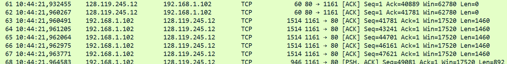

## A first look at the captured trace
1. The IP address is 192.168.102 and the TCP port number 1161 as seen in the following HTTP POST packet:
```text
No. Time Source Destination Protocol Length Info
199 10:44:25,867722 192.168.1.102 128.119.245.12 HTTP 104 POST /ethereal-labs/lab3-1-reply.htm HTTP/1.1
(text/plain)

Frame 199: Packet, 104 bytes on wire (832 bits), 104 bytes captured (832 bits)

Ethernet II
  Src: ActiontecEle_8a:70:1a (00:20:e0:8a:70:1a)
  Dst: LinksysGroup_da:af:73 (00:06:25:da:af:73)

Internet Protocol Version 4
  Src: 192.168.1.102
  Dst: 128.119.245.12

Transmission Control Protocol
  Src Port: 1161
  Dst Port: 80
  Seq: 164041
  Ack: 1
  Len: 50

  [122 Reassembled TCP Segments (164090 bytes):
    #4(565), #5(1460), #7(1460), #8(1460),
    #10(1460), #11(1460), #13(1147),
    #18(1460), #19(1460), #20(1460),
    #21(1460), #22(1460), #23(892),
    #30(1460), #31(1460), #32(1460),
    #33(1460), #34(1460)
  ]

Hypertext Transfer Protocol

MIME Multipart Media Encapsulation
  Type: multipart/form-data
  Boundary: ---------------------------265001916915724
```
2. The IP address of gaia.cs.umass.edu is 128.119.245.12 and the port number used 80 which makes sense since it's the default source port for HTTP incoming requests. This is evidenced by the packet referenced in 1.
3. 192.168.1.9, port 62319
```text
No. Time Source Destination Protocol Length Info
967 11:37:59.567238100 192.168.1.9 128.119.245.12 TLSv1.3 1187 Client Hello (SNI=gaia.cs.umass.edu)

Frame 967: Packet, 1187 bytes on wire (9496 bits), 1187 bytes captured (9496 bits)
Interface: \Device\NPF_{F20C0879-68C4-4DDF-8A8F-02CFF3A3458D}, id 0

Ethernet II
  Src: LiteonTechno_7d:70:79 (e0:0a:f6:7d:70:79)
  Dst: SagemcomBroa_e9:fc:47 (38:a6:59:e9:fc:47)

Internet Protocol Version 4
  Src: 192.168.1.9
  Dst: 128.119.245.12

Transmission Control Protocol
  Src Port: 62319
  Dst Port: 443
  Seq: 1453
  Ack: 1
  Len: 1133

  [2 Reassembled TCP Segments (2585 bytes):
    #966 (1452)
    #967 (1133)
  ]

Transport Layer Security (TLSv1.3)
  Handshake: Client Hello
  Server Name (SNI): gaia.cs.umass.edu
```
##  TCP Basics
4. The relative is 0 and the raw 2056818306:
```
No.  Time              Source        Destination     Protocol Length Info
961  11:37:59.368281  192.168.1.9   128.119.245.12  TCP      66     62319 → 443 [SYN] Seq=0 Win=65535 Len=0 MSS=1460 WS=256 SACK_PERM

Frame 961: Packet, 66 bytes on wire (528 bits), 66 bytes captured (528 bits) on interface
\Device\NPF_{F20C0879-68C4-4DDF-8A8F-02CFF3A3458D}, id 0

Ethernet II, Src: e0:0a:f6:7d:70:79 (LiteonTechno), Dst: 38:a6:59:e9:fc:47 (Sagemcom)
Internet Protocol Version 4, Src: 192.168.1.9, Dst: 128.119.245.12

Transmission Control Protocol, Src Port: 62319, Dst Port: 443, Seq: 0, Len: 0
    Source Port: 62319
    Destination Port: 443
    [Stream index: 8]
    [Stream Packet Number: 1]
    [Conversation completeness: Incomplete, DATA (15)]
    [TCP Segment Len: 0]

    Sequence Number: 0 (relative) <---- here
    Sequence Number (raw): 2056818306 <---- and here
    [Next Sequence Number: 1 (relative)]

    Acknowledgment Number: 0
    Acknowledgment number (raw): 0

    Header Length: 32 bytes (8)
    Flags: 0x002 (SYN)
    Window: 65535
    [Calculated window size: 65535]

    Checksum: 0x3995 [unverified]
    [Checksum Status: Unverified]

    Urgent Pointer: 0

    Options (12 bytes):
        MSS: 1460
        Window Scale: 256
        SACK Permitted
        NOP, NOP, NOP

    [Timestamps]
    [Client Contiguous Streams: 1]
    [Server Contiguous Streams: 1]
```
5. Relative is 0 and raw 2056818307 (+1 than the client's first SYN raw sequence number).

```
No.  Time              Source           Destination     Protocol Length Info
964  11:37:59.565935  128.119.245.12   192.168.1.9     TCP      66     443 → 62319 [SYN, ACK] Seq=0 Ack=1 Win=64240 Len=0 MSS=1452 WS=128 SACK_PERM

Frame 964: Packet, 66 bytes on wire (528 bits), 66 bytes captured (528 bits) on interface
\Device\NPF_{F20C0879-68C4-4DDF-8A8F-02CFF3A3458D}, id 0

Ethernet II, Src: 38:a6:59:e9:fc:47 (Sagemcom), Dst: e0:0a:f6:7d:70:79 (LiteonTechno)
Internet Protocol Version 4, Src: 128.119.245.12, Dst: 192.168.1.9

Transmission Control Protocol, Src Port: 443, Dst Port: 62319, Seq: 0, Ack: 1, Len: 0
    Source Port: 443
    Destination Port: 62319
    [Stream index: 8]
    [Stream Packet Number: 2]
    [Conversation completeness: Incomplete, DATA (15)]
    [TCP Segment Len: 0]

    Sequence Number: 0 (relative)
    Sequence Number (raw): 285911634
    [Next Sequence Number: 1 (relative)]

    Acknowledgment Number: 1 (relative)
    Acknowledgment number (raw): 2056818307

    Header Length: 32 bytes (8)
    Flags: 0x012 (SYN, ACK)
    Window: 64240
    [Calculated window size: 64240]

    Checksum: 0x833f [unverified]
    [Checksum Status: Unverified]

    Urgent Pointer: 0

    Options (12 bytes):
        MSS: 1452
        SACK Permitted
        Window Scale: 128
        NOP, NOP, NOP

    [Timestamps]
    [SEQ/ACK analysis]
    [Client Contiguous Streams: 1]
    [Server Contiguous Streams: 1]
```
6. Used course provided trace since my own used TLS and packet data was encrypted. Relative 1, raw 232129013

```
No.  Time              Source           Destination     Protocol Length Info
4    10:44:20.596858  192.168.1.102    128.119.245.12  TCP      619    1161 → 80 [PSH, ACK] Seq=1 Ack=1 Win=17520 Len=565

Frame 4: Packet, 619 bytes on wire (4952 bits), 619 bytes captured (4952 bits)

Ethernet II, Src: 00:20:e0:8a:70:1a (ActiontecEle), Dst: 00:06:25:da:af:73 (LinksysGroup)
Internet Protocol Version 4, Src: 192.168.1.102, Dst: 128.119.245.12

Transmission Control Protocol, Src Port: 1161, Dst Port: 80, Seq: 1, Ack: 1, Len: 565
    Source Port: 1161
    Destination Port: 80
    [Stream index: 0]
    [Stream Packet Number: 4]
    [Conversation completeness: Incomplete, DATA (15)]
    [TCP Segment Len: 565]

    Sequence Number: 1 (relative)
    Sequence Number (raw): 232129013
    [Next Sequence Number: 566 (relative)]

    Acknowledgment Number: 1 (relative)
    Acknowledgment number (raw): 883061786

    Header Length: 20 bytes (5)
    Flags: 0x018 (PSH, ACK)
    Window: 17520
    [Calculated window size: 17520]
    [Window size scaling factor: -2 (no window scaling used)]

    Checksum: 0x1fbd [unverified]
    [Checksum Status: Unverified]

    Urgent Pointer: 0

    [Timestamps]
    [SEQ/ACK analysis]
    [Client Contiguous Streams: 1]
    [Server Contiguous Streams: 1]

TCP payload (565 bytes)
Data (565 bytes)

0000  50 4f 53 54 20 2f 65 74 68 65 72 65 61 6c 2d 6c  POST /ethereal-l
0010  61 62 73 2f 6c 61 62 33 2d 31 2d 72 65 70 6c 79  abs/lab3-1-reply
0020  2e 68 74 6d 20 48 54 54 50 2f 31 2e 31 0d 0a 48  .htm HTTP/1.1..H
0030  6f 73 74 3a 20 67 61 69 61 2e 63 73 2e 75 6d 61  ost: gaia.cs.uma
0040  73 73 2e 65 64 75 0d 0a 55 73 65 72 2d 41 67 65  ss.edu..User-Age
0050  6e 74 3a 20 4d 6f 7a 69 6c 6c 61 2f 35 2e 30 20  nt: Mozilla/5.0 
0060  28 57 69 6e 64 6f 77 73 3b 20 55 3b 20 57 69 6e  (Windows; U; Win
0070  64 6f 77 73 20 4e 54 20 35 2e 31 3b 20 65 6e 2d  dows NT 5.1; en-
0080  55 53 3b 20 72 76 3a 31 2e 30 2e 32 29 20 47 65  US; rv:1.0.2) Ge
0090  63 6b 6f 2f 32 30 30 33 30 32 30 38 20 4e 65 74  cko/20030208 Net
00a0  73 63 61 70 65 2f 37 2e 30 32 0d 0a 41 63 63 65  scape/7.02..Acce
00b0  70 74 3a 20 74 65 78 74 2f 78 6d 6c 2c 61 70 70  pt: text/xml,app
00c0  6c 69 63 61 74 69 6f 6e 2f 78 6d 6c 2c 61 70 70  lication/xml,app
00d0  6c 69 63 61 74 69 6f 6e 2f 78 68 74 6d 6c 2b 78  lication/xhtml+x
00e0  6d 6c 2c 74 65 78 74 2f 68 74 6d 6c 3b 71 3d 30  ml,text/html;q=0
00f0  2e 39 2c 74 65 78 74 2f 70 6c 61 69 6e 3b 71 3d  .9,text/plain;q=
0100  30 2e 38 2c 76 69 64 65 6f 2f 78 2d 6d 6e 67 2c  0.8,video/x-mng,
0110  69 6d 61 67 65 2f 70 6e 67 2c 69 6d 61 67 65 2f  image/png,image/
0120  6a 70 65 67 2c 69 6d 61 67 65 2f 67 69 66 3b 71  jpeg,image/gif;q
0130  3d 30 2e 32 2c 74 65 78 74 2f 63 73 73 2c 2a 2f  =0.2,text/css,*/
0140  2a 3b 71 3d 30 2e 31 0d 0a 41 63 63 65 70 74 2d  *;q=0.1..Accept-
0150  4c 61 6e 67 75 61 67 65 3a 20 65 6e 2d 75 73 2c  Language: en-us,
0160  20 65 6e 3b 71 3d 30 2e 35 30 0d 0a 41 63 63 65   en;q=0.50..Acce
0170  70 74 2d 45 6e 63 6f 64 69 6e 67 3a 20 67 7a 69  pt-Encoding: gzi
0180  70 2c 20 64 65 66 6c 61 74 65 2c 20 63 6f 6d 70  p, deflate, comp
0190  72 65 73 73 3b 71 3d 30 2e 39 0d 0a 41 63 63 65  ress;q=0.9..Acce
01a0  70 74 2d 43 68 61 72 73 65 74 3a 20 49 53 4f 2d  pt-Charset: ISO-
01b0  38 38 35 39 2d 31 2c 20 75 74 66 2d 38 3b 71 3d  8859-1, utf-8;q=
01c0  30 2e 36 36 2c 20 2a 3b 71 3d 30 2e 36 36 0d 0a  0.66, *;q=0.66..
01d0  4b 65 65 70 2d 41 6c 69 76 65 3a 20 33 30 30 0d  Keep-Alive: 300.
01e0  0a 43 6f 6e 6e 65 63 74 69 6f 6e 3a 20 6b 65 65  .Connection: kee
01f0  70 2d 61 6c 69 76 65 0d 0a 52 65 66 65 72 65 72  p-alive..Referer
0200  3a 20 68 74 74 70 3a 2f 2f 67 61 69 61 2e 63 73  : http://gaia.cs
0210  2e 75 6d 61 73 73 2e 65 64 75 2f 65 74 68 65 72  .umass.edu/ether
0220  65 61 6c 2d 6c 61 62 73 2f 6c 61 62 33 2d 31 2e  eal-labs/lab3-1.
0230  68 74 6d 0d 0a                                htm..

Data […]:
504f5354202f657468657265616c2d6c6162732f6c6162332d312d7265706c792e68746d20485454502f312e310d0a486f73743a20676169612e63732e756d6173732e6564750d0a557365722d4167656e743a204d6f7a696c6c612f352e30202857696e646f77733b20553b2057696e646
[Length: 565]
```

7. 
| Segment | Sequence Number | Payload (bytes) | Time            | ACK time received | RTT (ms) | Estimated RTT (ms) |
|--------:|----------------:|----------------:|-----------------|-------------------|----------:|-------------------:|
| 1       | 0               | 565             | 10:44:20.596858 | 10:44:20.624318   | 27.460    | 27.460             |
| 2       | 565             | 1460            | 10:44:20.596858 | 10:44:20.624318   | 27.460    | 27.460             |
| 3       | 2025            | 1460            | 10:44:20.624407 | 10:44:20.647675   | 23.268    | 26.936             |
| 4       | 3485            | 1460            | 10:44:20.625071 | 10:44:20.694446   | 69.375    | 32.241             |
| 5       | 4945            | 1460            | 10:44:20.647786 | 10:44:20.739449   | 91.663    | 39.669             |
| 6       | 6405            | 1460            | 10:44:20.648538 | 10:44:20.787680   | 139.142   | 52.103             |

8. Payload column in table of 7.
9. The minimum buffer size length is 5840. No.
10. Not in the example trace but in mine there was one:
```
No.  Time              Source           Destination     Protocol Length Info
282  11:37:52.104057  128.119.245.12   192.168.1.9     TLSv1.2  78     [TCP Retransmission], Application Data

Frame 282: Packet, 78 bytes on wire (624 bits), 78 bytes captured (624 bits) on interface
\Device\NPF_{F20C0879-68C4-4DDF-8A8F-02CFF3A3458D}, id 0

Ethernet II, Src: 38:a6:59:e9:fc:47 (Sagemcom), Dst: e0:0a:f6:7d:70:79 (LiteonTechno)
Internet Protocol Version 4, Src: 128.119.245.12, Dst: 192.168.1.9

Transmission Control Protocol, Src Port: 443, Dst Port: 62313, Seq: 4294967273, Ack: 1, Len: 24
    Source Port: 443
    Destination Port: 62313
    [Stream index: 2]
    [Stream Packet Number: 2]
    [Conversation completeness: Incomplete (28)]
    [TCP Segment Len: 24]

    Sequence Number: 4294967273 (relative)
    Sequence Number (raw): 4095744935
    [Next Sequence Number: 1 (relative)]

    Acknowledgment Number: 1 (relative)
    Acknowledgment number (raw): 1122839455

    Header Length: 20 bytes (5)
    Flags: 0x018 (PSH, ACK)
    Window: 484
    [Calculated window size: 484]
    [Window size scaling factor: -1 (unknown)]

    Checksum: 0x05ca [unverified]
    [Checksum Status: Unverified]

    Urgent Pointer: 0

    [Timestamps]
    [SEQ/ACK analysis]
    [Client Contiguous Streams: 1]
    [Server Contiguous Streams: 1]

TCP payload (24 bytes)
Transport Layer Security
```
11. Between 1460 to 2920 bytes (1460 x 2)
Here's a sequence example:

It shows delayed ACK behavior, where the receiver does not acknowledge every segment individually but instead acknowledges multiple segments cumulatively. This is consistent with TCP’s delayed ACK mechanism, although the exact pattern is not strictly one ACK per two full segments.