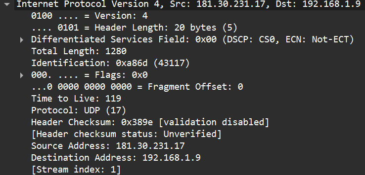

1.
```
No.     Time                  Source           Destination    Protocol  Length  Info
3647    13:55:05.139553500    181.30.231.17    192.168.1.9    UDP       1294    443 → 55286    Len=1252
Frame 3647: Packet, 1294 bytes on wire (10352 bits), 1294 bytes captured (10352 bits) on interface
\Device\NPF_{F20C0879-68C4-4DDF-8A8F-02CFF3A3458D}, id 0
Ethernet II, Src: SagemcomBroa_e9:fc:45 (38:a6:59:e9:fc:45), Dst: LiteonTechno_7d:70:79 (e0:0a:f6:7d:70:79)
Internet Protocol Version 4, Src: 181.30.231.17, Dst: 192.168.1.9
User Datagram Protocol, Src Port: 443, Dst Port: 55286
Data (1252 bytes)
0000  4c 1d 74 78 52 36 df dd b6 6d 76 9c e1 dd 05 3d   L.txR6...mv....=
0010  ee 72 3b ac 8b c9 3f d3 e9 44 24 b2 2f 29 fa cb   .r;...?..D$./)..
0020  e7 2a 87 b2 43 39 f5 0f 2b a3 9e c3 39 4e d8 86   ...C9..+...9N..
0030  b0 d6 3b 12 93 b4 8f f5 bd 4e d2 9e e5 db a1 e0   ..;......N......
0040  0f 1b 0f 57 eb 1c 10 bc f8 ae a0 a0 59 6d 18 76   ...W........Ym.v
0050  3b 6e 77 49 44 64 b6 95 a5 7f d3 03 29 1e 52 86   ;nwIDd......).R.
```
Headers (4, each 2 bytes):
- Source port
- Destination port
- Length
- Checksum
2. 2 bytes, each header is represented by two pairs of hex numbers where each corresponds to a 8-bit number, 2 8-bit number -> 2 bytes
3. The length field specifies the number of bytes in the UDP segment (header plus data). In the packet we have `Length: 1260` and a UDP payload of 1252 bytes. 1260 - 8 bytes from headers = 1252 bytes of data.
4. 65527, since the header `Length` takes up 2 bytes, the maximum number represented by a 16-bit number is 65535 and we use 8 for the header data.
5. 65535
6. 17, 0x11
 
 