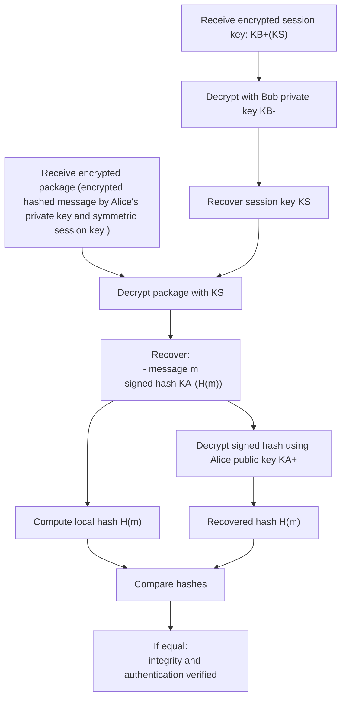

## SECTION 8.1
**R1.**
Confidentiality means that only the sender and the receiver in the communication know the contents of the transmitted message. Integrity means that the contents of the message have not been altered.

Yes. Example: A and B communicate using encryption, but without authentication. An attacker cannot read the message contents, so confidentiality exists. However, the attacker can still modify the encrypted data in transit, so integrity is not guaranteed by for example altering bits in a ciphertext.

Yes, we can have integrity without confidentiality. An example is a message in a public channel from A to B. It's visible to participants in the channel but as long as the content of the communication hasn't been altered then the integrity is preserved.

---
**R2.** Customer using a bank app and the server responding its requests. Two user end systems involved in a communication via an app like WhatsApp.DNS client to DNS resolver to hide DNS queries from intermediaries.

---
## SECTION 8.2
**R3.** In a symmetric-key system both parties have the same key, in a public one a pair of keys is used where one of them is known to one of the two participants and the other one is public.

---
**R4.** Known-plaintext since the intruder will determinate pairings from the encrypted message-decrypted version pair.

---
**R5.** There are $2^8=256$ possible inputs. To get the possible mappings we get all the possible permutations: $256!=8.5782×10^{506}$, a considerable big number with 507 digits, if we view each mapping as a key then we have the same amount of keys than mapping, theoretically, in real-world scenarios we don't store entire mappings to use as keys since it's impractical for 64-bit block ciphers for example, which are not trivial to break.

---
**R6.**

---
**R7.** Using the identity $[(a\bmod n)\times (b\bmod n)]\bmod n=(a\times b)\bmod n$ we can get to multiplying 23 by 24 and since the result is < $n$ we can be sure that's the result.

---
**R8.** The decimal number would be the integer representation of 10101111 which in this case is 175.

---
## SECTIONS 8.3-8.4
**R9.** In the way that for hash functions is computationally infeasible to find any two different messages x and y such that $H(x)=H(y)$. With checksums, given the original data, it is simple to find another set of data with the same checksum. Like in the example of the book "IOU100.99BOB" and "IOU900.99BOB".

---
**R10.** No, that's the main purpose of hash functions. They are **many-to-1** mappings, in contrast to block ciphers that are 1:1. They take an input of _any_ size (a single word or the entire contents of Wikipedia) and crushes it down into a fixed-size string of bits (256 bits for SHA-256, for example).

---
**R11.** Yes, it's totally flawed. It's exposing the authentication key in every message since the pattern can be easily recognized by anyone that can see the messages. And not only that, if an intruder C has the hash function, he can trivially get the authentication key $s$ doing $s = T - H(m)$ where $T$ is the concatenation of $H(m)$ and $s$.

---
**R12.** **Verifiable** means that it must be possible to prove that a document signed by an individual was indeed signed by that individual.

**Nonforgeable** means that it must be possible to prove that **only that** individual could've signed the document.

---
**R13.** In that calculating $K^-(H(m))$ (where $K^-$ is the private key, $H$ the has function and $m$ the message to sign) is generally much less expensive than just using the original message $m$ instead of $H(m)$. The computational effort required to create the digital signature is substantially reduced.

---
**R14.** True. Otherwise there would be no way for anyone interested on verifying that a message signed by foo.com comes actually from foo.com to do so.

---
**R15.**

---
**R16.** The purpose of a nonce is to ensure that old communications cannot be reused, for example in playback/replay attacks such as leaked encrypted or not passwords. The nonce makes each communcation unique.

---
**R17.** It means that it's used only in one session, from the client initial request until the session is closed.

>In whose lifetime?

During the operational lifetime of the relevant cryptographic context.

---
**R18.** Yes, since an eavesdropper can resend $(m, H(m + s)$. A nonce could be incorporated like $(m, N, HMAC_s​(m∥N))$ where $N$ is the nonce. The receiver checks whether the nonce was already used or not.

---
## SECTIONS 8.5-8.8
**R20.** False. The sequence numbers are tracked by the parties involved in the communication including it in the HMAC calculation but not in the records:

> The solution to this problem, as you probably guessed, is to use sequence numbers. TLS does this as follows. Bob maintains a sequence number counter, which begins at zero and is incremented for each TLS record he sends. Bob doesn’t actually include a sequence number in the record itself, but when he calculates the HMAC, he includes the sequence number in the HMAC calculation. Thus, the HMAC is now a hash of the data plus the HMAC key MB plus the current sequence number. Alice tracks Bob’s sequence numbers, allowing her to verify the data integrity of a record by including the appropriate sequence number in the HMAC calculation. This use of TLS sequence numbers prevents Trudy from carrying out a woman-in-the-middle attack, such as reordering or replaying segments

---
**R21.** They are used in the creation of the session keys and to prevent connection replay attacks from intruders that might've sniffed all messages between A and B and tries to use the exact same sequence of messages.

---
**R22.** 

---
**R23.** In step 6. when Bob receives Trudy HMAC of the concatenation of all the handshake messages since Trudy doesn't have Alice's private key to properly compute the MS.

---
## PROBLEMS
**P2.** To determine all the possible pairings for the monoalphabetic cipher we need to calculate $26!$ which is approximately $400,000,000,000,000,000,000,000$.

Now, if we know seven pairings, the number is reduced to $19!$.

The ratio between both $26!/19!=3.3×10^9$, which corresponds to the $10^9$ reduction of substitutions mentioned in the problem statement.

---
**P4.**
a) Since the scrambler does not modify bits, each 10100000 will be reversed to 00000101, then to 10100000 and finally to 00000101 again. The final output will be 00000101 repeated eight times.

b) 00000101 repeated seven times plus 10000101

c)10100001 plus 00000101 seven times

---
**P6.** 
a) 011011011

b) That the input is the same value repeated three times.

c) Calculate:
1. $c(1) = K_S(m(1) ⊕ c(0))=100$
2. $c(2) = K_S(m(2) ⊕ c(1))=110$
3. $c(3) = K_S(m(3) ⊕ c(2))=101$

Final result: 100110101. Even if the ciphertext is sniffer, the intruder won't be able to tell the original input was the same value three times like it happened when we didn't use CBC.

---
**P8.**
a) $n=pq=55$ and $z=(p-1)(q-1)=40$
b) It's less than $n$ and has no common factors with $z$ except for 1. 4, 5 and 6 have other common factors besides 1 with 40, for exapmle.
c) 
$de \equiv 1 \pmod{z}$
$3d \equiv 1 \pmod{z}$
which is the same as
$3d=1+40k$

If $k=1$, $41/3$ doesn't result in an integer so we skip to $k=2$, $3d =81$, which results in $d=27$

---

**P13.** Assuming $b$ the block, a hash function $H$:

1. The trusted .torrent file contains the hash $h = H(b)$ for each block.
2. When Peer B receives a block $b$ from another peer, it computes $H(b)$ and compares it with the corresponding trusted hash from the .torrent file.
3. If the hashes match, the block is accepted and redistributed; otherwise it is discarded as bogus.

There's no need of a common secret since the file comes from a _fully_ trusted source as per the problem statement.

---
**P17.**

**P19.**

**a.** It's sent by the client. Looking at packet 106, the `Client Hello` is sent by 128.238.38.162 and `Server Hello` in packet 108 is sent by 216.75.194.220, the server.
**b.** 216.75.194.220, port 443 (HTTPS)
**c.** 80
**d.** Three. Handshake Protocol: Client Key Exchange, Change Cipher Spec and Handshake Protocol: Enrypted Handshake Message
**e.** Neither. It contains the pre-master secret, both sides *derive* the master secret but it's never shared.
**f.** 
**g.** 5: Client Hello, Server Hello, Certificate, Server Hello Done and Client Key Exchange
**h.** Same as the client, they both verify the hashes match to protect the handshake from tampering. 

---
**P22.**
**a.** False, because there's no security association between a host in 172.16.1/24 and an Amazon.com server. The latter wouldn't be able to decrypt the encrypted IPsec datagram.

**b.** True. In tunnel mode. False, for transport mode.

**c.** True.

**d.** False. IPsec sequence numbers are for replay attacks, not for retransmission, and R1 will resend the segment because the acknowledgment is not going to be received.

---
**P25.**

a)
```
Alice                    Proxy1
  |                        |
  |---K1+(S1)------------->|
  |                        | (decrypts with K1- to get S1)
  |                        |
```

b)
```
Alice                    Proxy1                          Proxy2 
  |                        |                                |
  |---S1(K2+(S2))--------->|                                |
  |                        | (decrypts with S1)             |
  |                        |                                |
  |                        |                                |
  |---K1+(S1(m))           | -------------K2+(S2)---------->|
  |                        |                                | (decrypts with K2-)
  |                        |                                | (gets S2)
```

c)
$m_1 = Proxy2, S2(activist.com, HTTP_{req})$
$m2=activist.com, HTTP_{req}$
```
Alice               Proxy1                    Proxy2            activist.com 
  |                   |                          |                    |
  |------S1(m1)------>|                          |                    |
  |                   | (decrypts with S1,       |                    |
  |                   |  sees Proxy2 address)    |                    |
  |                   |--------S2(m2)----------->|
  |                   |                          |                    |
  |                   |                          |(decrypts with S2,  |
  |                   |                          | sees activist.com) |
  |                   |                          |----HTTP request--->|
```