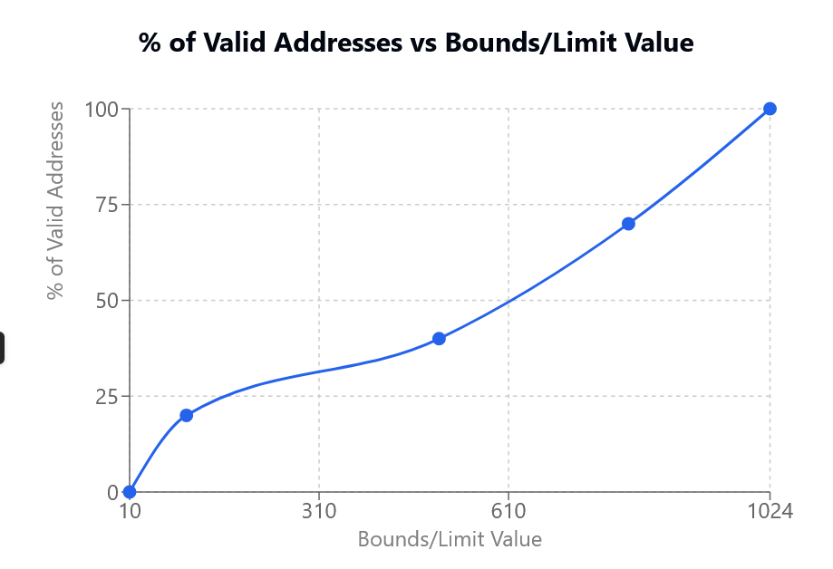

2. To 930 since the virtual address with the largest number is in 929. With 930 we ensure are all within bounds.

3. With a default address space of 1000 and since the physical mem size is 16k the maximum possible base value is 16284 since Base = 16284 + Limit = 100 <= Psize = 16384. Any value beyond that will end up with an address space that doesn't fit into physical memory.

5. Assuming a constant base value, the fraction of valid virtual addresses increases as the value of bounds increases. If limit = 256 -> valid fractions are 256/1024 with address space of 1024. If limit is 1024, all addresses will be valid.

Plot from running 5 experiments with `-n 10`

