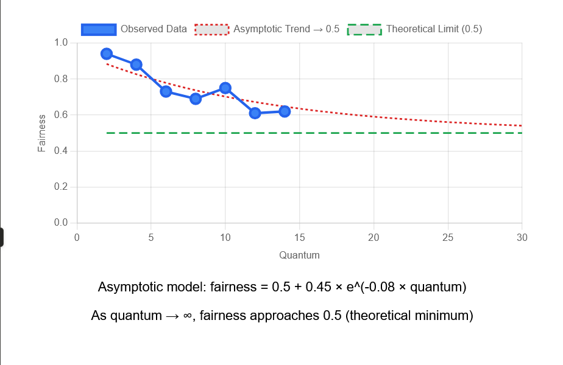

2.
```
** Computed Results **
Listing jobs with their durations and ticket allocations: 
  Job 0 | duration: 10 | tickets: 1
  Job 1 | duration: 10 | tickets: 100


** Computed Results **

Random 844422 -> Winning ticket 62 (of 101) -> Run 1
  Jobs: (  job:0 timeleft:10 tix:1 )  (* job:1 timeleft:10 tix:100 ) 
Random 757955 -> Winning ticket 51 (of 101) -> Run 1
  Jobs: (  job:0 timeleft:10 tix:1 )  (* job:1 timeleft:9 tix:100 ) 
Random 420572 -> Winning ticket 8 (of 101) -> Run 1
  Jobs: (  job:0 timeleft:10 tix:1 )  (* job:1 timeleft:8 tix:100 ) 
Random 258917 -> Winning ticket 54 (of 101) -> Run 1
  Jobs: (  job:0 timeleft:10 tix:1 )  (* job:1 timeleft:7 tix:100 ) 
Random 511275 -> Winning ticket 13 (of 101) -> Run 1
  Jobs: (  job:0 timeleft:10 tix:1 )  (* job:1 timeleft:6 tix:100 ) 
Random 404934 -> Winning ticket 25 (of 101) -> Run 1
  Jobs: (  job:0 timeleft:10 tix:1 )  (* job:1 timeleft:5 tix:100 ) 
Random 783799 -> Winning ticket 39 (of 101) -> Run 1
  Jobs: (  job:0 timeleft:10 tix:1 )  (* job:1 timeleft:4 tix:100 ) 
Random 303313 -> Winning ticket 10 (of 101) -> Run 1
  Jobs: (  job:0 timeleft:10 tix:1 )  (* job:1 timeleft:3 tix:100 ) 
Random 476597 -> Winning ticket 79 (of 101) -> Run 1
  Jobs: (  job:0 timeleft:10 tix:1 )  (* job:1 timeleft:2 tix:100 ) 
Random 583382 -> Winning ticket 6 (of 101) -> Run 1
  Jobs: (  job:0 timeleft:10 tix:1 )  (* job:1 timeleft:1 tix:100 ) 
--> JOB 1 DONE at time 10
Random 908113 -> Winning ticket 0 (of 1) -> Run 0
  Jobs: (* job:0 timeleft:10 tix:1 )  (  job:1 timeleft:0 tix:--- ) 
Random 504687 -> Winning ticket 0 (of 1) -> Run 0
  Jobs: (* job:0 timeleft:9 tix:1 )  (  job:1 timeleft:0 tix:--- ) 
Random 281838 -> Winning ticket 0 (of 1) -> Run 0
  Jobs: (* job:0 timeleft:8 tix:1 )  (  job:1 timeleft:0 tix:--- ) 
Random 755804 -> Winning ticket 0 (of 1) -> Run 0
  Jobs: (* job:0 timeleft:7 tix:1 )  (  job:1 timeleft:0 tix:--- ) 
Random 618369 -> Winning ticket 0 (of 1) -> Run 0
  Jobs: (* job:0 timeleft:6 tix:1 )  (  job:1 timeleft:0 tix:--- ) 
Random 250506 -> Winning ticket 0 (of 1) -> Run 0
  Jobs: (* job:0 timeleft:5 tix:1 )  (  job:1 timeleft:0 tix:--- ) 
Random 909747 -> Winning ticket 0 (of 1) -> Run 0
  Jobs: (* job:0 timeleft:4 tix:1 )  (  job:1 timeleft:0 tix:--- ) 
Random 982786 -> Winning ticket 0 (of 1) -> Run 0
  Jobs: (* job:0 timeleft:3 tix:1 )  (  job:1 timeleft:0 tix:--- ) 
Random 810218 -> Winning ticket 0 (of 1) -> Run 0
  Jobs: (* job:0 timeleft:2 tix:1 )  (  job:1 timeleft:0 tix:--- ) 
Random 902166 -> Winning ticket 0 (of 1) -> Run 0
  Jobs: (* job:0 timeleft:1 tix:1 )  (  job:1 timeleft:0 tix:--- ) 
--> JOB 0 DONE at time 20
```

When the number of tickets is so imbalanced the job with more tickets will run almost every time. It'll run only 1/101 of the times while the job with 100 tickets hasn't finished.

With such a ticket imbalance it resembles a priority scheduler (weighted fairness), where the high-ticket job gets almost all the CPU.
3. Running 5 jobs we get the following fairness values, using F = job 1 finish time / job 2 finish time:

- 0.97
- 0.95
- 1.08
- 0.98
- 0.9

Which means that it's pretty close to a perfectly fair scheduler (one with a value of 1).

4.
Quantum of 2 -> 0.94
Quantum of 4 -> 0.88
Quantum of 6 -> 0.73
Quantum of 8 -> 0.69
Quantum of 10 -> 0.75
Quantum of 12 -> 0.61
Quantum of 14 -> 0.62

Fairness decreases as quanta increases. It's equivalent to running jobs of short length where the lottery scheduler approach don't have enough run times to approach a fair division of the total time.

5. 
